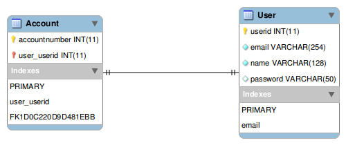

WSO2 Carbon 5 - multi-tenancy demonstration - data layer micro-service
======================================================================

### MySQL database configuration ###

* Navigate to `src/main/resources/configuration` directory. Here you will find the database configuration for the data-layer micro-service (configuration.properties) and the database configuration for the test cases (test.configuration.properties) of the data layer micro-service.

* In each of the configuration files you will find the following key-pair values
    * `javax.persistence.jdbc.driver=com.mysql.jdbc.Driver`
    * `javax.persistence.jdbc.url=jdbc:mysql://localhost:3306/accounts`
    * `javax.persistence.jdbc.user=root`
    * `javax.persistence.jdbc.password=root`

* For changing the database name, edit `javax.persistence.jdbc.url` key. The value should be `jdbc:mysql://localhost:`\<MySQL port\>`/`\<Database name\>. The default value ofthe \<MySQL port\> is `3306`

* For changing the username and password for the MySQL login change `javax.persistence.jdbc.user` and `javax.persistence.jdbc.password` respectively.

### ER diagram of the data layer micro-service ###

